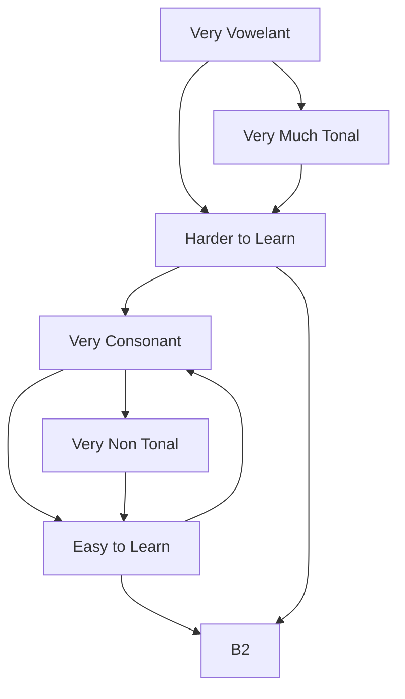

We can put `A2[Very Phonetically Mixed] --> B2[Very Tonally Mixed]` between the first two childs of the first wrapper but we don't have too. 
it's just important to remember that there can be many intermediate categorizations btween the two children.
