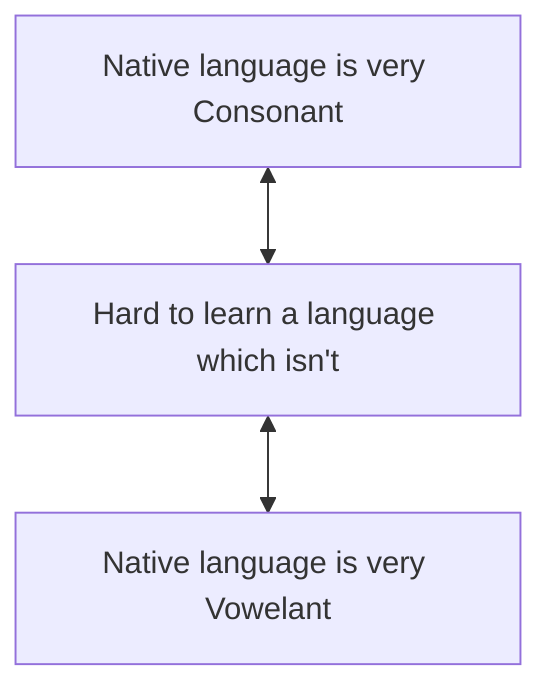

A Human General Communication Language can be either:

```mermaid
flowchart TD
  A1[Native language is very Consonant] <--> B1[Hard to learn a language which isn't] <-->  A2[Native language is very Vowelant]
```
