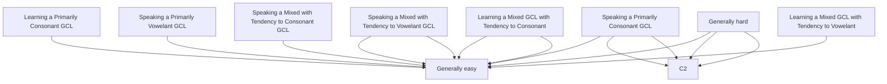

From my experience, a General Communication Language (GCL) can be either:

1. Primarily Consonant
1. Primarily vowelant
1. Mixed with a tendency to consonant
1. Mixed with a tendency to vowelant

English and Russian are of type 1, while Thai and Vietnamese of type 4 and therefore type 1 speakers could learn each other's languages fast, but will have a hard time learning type 4 languages and vice versa.

But

Speakers of type 3 and type 4 could learn each other's language fast because both types are mixed.

