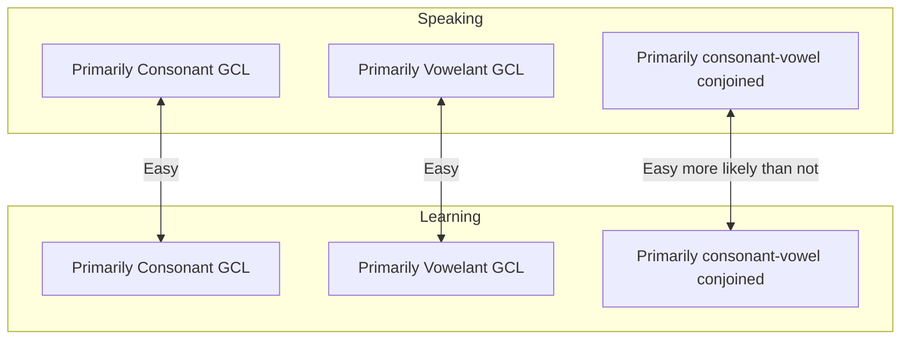

From my experience, a General Communication Language (GCL) can be either:

1. Primarily consonant
1. Primarily vowelant
1. Primarily consonant-vowel conjoined

English and Russian are of type 1, while Thai and Vietnamese of type 3 and therefore type 1 speakers could learn each other's languages fast, but will have a hard time learning type 3 languages and vice versa.

## Charts

