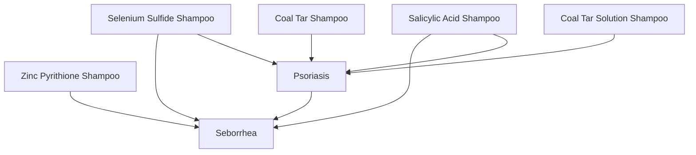

## Markdown

Applying color in Mermaid in year 2025 can be cumbersome so here is a way in a Markdown:

| Shampoo Name                  | Main Use(s)            |
|-------------------------------|------------------------|
| Zinc Pyrithione Shampoo    | Seborrhea              |
| Ketoconazole Shampoo       | Seborrhea              |
| Selenium Sulfide Shampoo    | Seborrhea, Psoriasis   |
| Salicylic Acid Shampoo      | Seborrhea, Psoriasis   |
| Coal Tar Shampoo             | Psoriasis              |
| Coal Tar Solution Shampoo    | Psoriasis              |
## Mermaid

