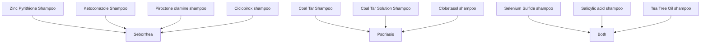

## Markdown

Applying color in Mermaid in year 2025 can be cumbersome so here is a way in a Markdown:

| Shampoo type                    | Purpose                         |
|---------------------------------|---------------------------------|
| Zinc pyrithione shampoo         | Mainly for Seborrhea            |
| Ketoconazole shampoo            | Mainly for Seborrhea            |
| Piroctone olamine               | Mainly for Seborrhea            |
| Ciclopirox shampoo              | Mainly for Seborrhea            |
|                                 |                                 |
| Coal tar shampoo                | Mainly for Psoriasis            |
| Coal tar solution shampoo       | Mainly for Psoriasis            |
| Clobetasol shampoo              | Mainly for Psoriasis            |
|                                 |                                 |
| Selenium Sulfide shampoo        | For Seborrhea and Psoriasis     |
| Salicylic acid shampoo          | For Seborrhea and Psoriasis     |
| Tea Tree Oil shampoo            | For Seborrhea and Psoriasis     |

## Mermaid

