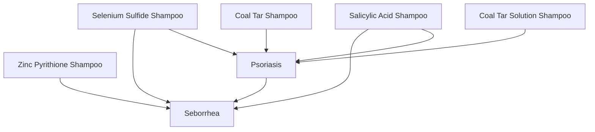

## Markdown first

| Shampoo Name                  | Main Use(s)            |
|-------------------------------|------------------------|
| Zinc Pyrithione Shampoo        | Seborrhea              |
| Ketoconazole Shampoo           | Seborrhea              |
| Selenium Sulfide Shampoo       | Seborrhea, Psoriasis   |
| Salicylic Acid Shampoo         | Seborrhea, Psoriasis   |
| Coal Tar Shampoo               | Psoriasis              |
| Coal Tar Solution Shampoo      | Psoriasis              |

## Mermaid

